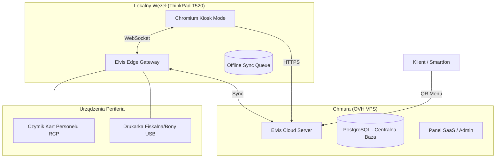

# Elvis POS — Architektura Hybrydowa (Cloud-Edge)

System Elvis POS opiera się na modelu hybrydowym, łączącym stabilność chmury (VPS) z niezawodnością lokalnego terminala (T520).

## 🏗️ Schemat Systemu

## Komponenty Systemu

### 1. Cloud Backend (FastAPI + PostgreSQL)
- **Lokalizacja**: Serwer VPS na OVH (Debian 12).
- **Rola**: "Mózg" systemu. Przechowuje menu, zamówienia, historię pracowników i statystyki.
- **Dostęp**: Dostępny pod domenami `*.zjedz.it`.

### 2. Edge Node (T520 + Debian)
- **Lokalizacja**: Terminal w food trucku.
- **Rola**: "Cienki klient" (Thin Client) oraz mostek sprzętowy.
- **Niezawodność**: Dzięki wbudowanej baterii w T520, system jest odporny na nagłe braki zasilania.

### 3. Elvis Edge Gateway (Python)
- **Funkcja**: Lokalne API działające na T520.
- **Offline Mode**: Zapisuje zamówienia w lokalnej bazie SQLite, gdy połączenie z OVH zostanie przerwane.
- **Hardware Proxy**: Przekazuje dane z przeglądarki do drukarki USB oraz odbiera sygnały z czytnika NFC.

### 4. System RCP (NFC)
- **Logowanie**: Każdy pracownik posiada kartę/brelok NFC.
- **Zabezpieczenie**: Krytyczne funkcje panelu wydawki (rabaty, zwroty) wymagają zbliżenia karty pracownika.

---

## 🚀 Zalety Modelu Cloud-Edge
1. **Dostęp z każdego miejsca**: Właściciel widzi sprzedaż na żywo na telefonie przez panel Cloud.
2. **Praca bez internetu**: Sprzedaż nie zostaje przerwana przy awarii LTE – dane zsynchronizują się automatycznie po powrocie sieci.
3. **Pancerny sprzęt**: ThinkPad T520 z dyskiem SSD jest znacznie trwalszy niż tablety czy Raspberry Pi.
