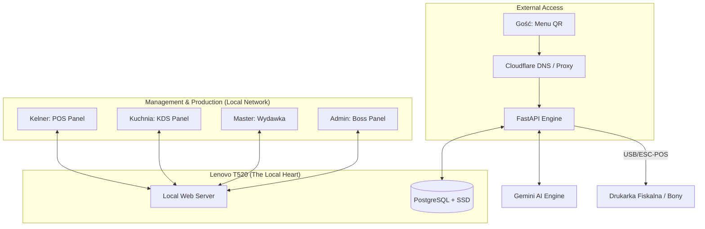

# Zjedz.it POS — Schemat Architektury (Edge-Master)

## Architektura Wysokiego Poziomu

## Komponenty Systemu

### 1. Edge-Master Backend (FastAPI)
- **Host**: Lenovo T520 z Ubuntu/Debian.
- **Pamięć**: Dysk SSD (Błyskawiczny odczyt/zapis).
- **Funkcja**: Całość logiki biznesowej działa lokalnie wewnątrz lokalu.
- **Real-time**: WebSocket Manager zarządza komunikacją między panelami obsługi a klientami.

### 2. Baza Danych (PostgreSQL)
- **Przechowywanie**: Wszystkie dane (Menu, Zamówienia, Użytkownicy) znajdują się na lokalnym dysku SSD.
- **Zaleta**: Brak opóźnień sieciowych (latency) przy zapytaniach do bazy.
- **Niezawodność**: System działa w 100% poprawnie nawet przy słabym połączeniu internetowym.

### 3. Networking (Cloudflare Proxy)
- **Domena**: Kierowana przez Cloudflare do publicznego IP lokalu (lub przez Cloudflare Tunnel).
- **Bezpieczeństwo**: Szyfrowanie SSL (HTTPS) oraz ochrona przed atakami DDoS.
- **DynDNS**: Automatyczna aktualizacja adresu IP w panelu Cloudflare.

### 4. Inteligencja (Gemini AI)
- **Integracja**: System łączy się z modelem Gemini przez API.
- **Zadanie**: Generowanie personalizowanych treści (AI Storyteller) oraz analityka trendów dla właściciela.

### 5. Frontend & Auth
- **Technologia**: Vanilla JS + Modern CSS (Glassmorphism).
- **Logowanie**:
    - Admin/Master: PIN lub autoryzacja sprzętowa.
    - Pracownicy: Szybki PIN ( Staff Collection).
    - Goście: Sesja anonimowa generowana przy skanowaniu QR.
