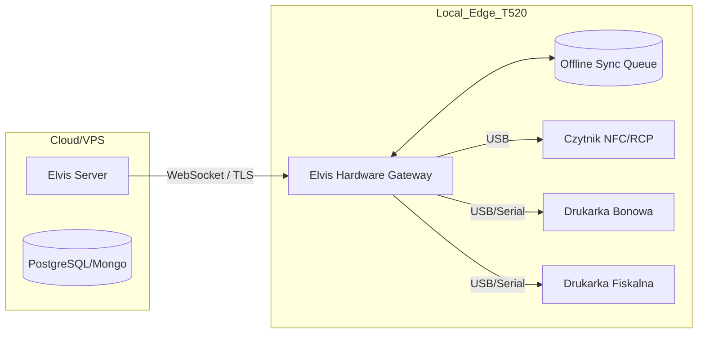

# Elvis POS Expansion Roadmap (Zjedz.it)

Ten dokument przedstawia strategiczny plan rozwoju systemu Elvis POS, koncentrując się na integracji sprzętowej, zamówieniach online oraz zaawansowanej analityce AI.

## 🚀 Faza 1: Universal Hardware Gateway (Maj 2026)
*Cel: Umożliwienie stabilnej komunikacji z urządzeniami peryferyjnymi niezależnie od lokalizacji serwera.*

- [ ] **Unified Printer API**: Stworzenie ujednoliconego interfejsu dla drukarek bonowych (ESC/POS) działającego przez WebSocket.
- [ ] **Integracja Fiskalna**: Obsługa protokołów Posnet/Novitus dla polskich drukarek fiskalnych (wymaga lokalnego agenta na terminalu T520).
- [ ] **Edge Offline Sync**: Implementacja lokalnej kolejki zamówień (SQLite/IndexedDB), umożliwiającej sprzedaż przy braku internetu i automatyczną synchronizację z OVH po odzyskaniu połączenia.
- [ ] **NFC RCP Access Control**: System logowania personelu (Rejestracja Czasu Pracy) przez NFC. Blokada funkcji krytycznych (rabaty, zwroty, raporty) dla osób nieuprawnionych.
- [ ] **Hardware Health Monitoring**: Podgląd statusu online/offline drukarek i terminali w panelu Master/Admin.
- [ ] **QR Kitchen Labels**: Automatyczne drukowanie etykiet z QR kodem dla zamówień na wynos.

## 🍔 Faza 2: Online Ordering & Bar Pickup (Czerwiec 2026)
*Cel: Rozszerzenie sprzedaży poza lokal i optymalizacja odbiorów osobistych.*

- [ ] **Moduł `/online`**: Lekki sklep internetowy zintegrowany bezpośrednio z aktualnym menu i stanami magazynowymi.
- [ ] **Bar Pickup Slots**: Możliwość wybrania godziny odbioru przy barze (np. "Gotowe za 15 min").
- [ ] **Status zamówienia SMS/Push**: Informowanie klienta, że jego burger jest „W przygotowaniu” lub „Gotowy do odbioru”.
- [ ] **Online-to-KDS Sync**: Automatyczne wpada zamówień online na ekrany kuchenne z oznaczeniem "PICKUP".

## 📅 Faza 3: Smart Reservations (Lipiec 2026)
*Cel: Zarządzanie ruchem w lokalu i unikanie "pustych przebiegów".*

- [ ] **Reservation Engine**: System rezerwacji stolików zintegrowany z Mapą Sali w `/admin`.
- [ ] **Customer History**: Automatyczne rozpoznawanie powracających gości po numerze telefonu.
- [ ] **Pre-order with Reservation**: Możliwość zamówienia jedzenia z wyprzedzeniem przy rezerwacji stolika.
- [ ] **SMS Reminders**: Automatyczne przypomnienia o rezerwacji 1h przed terminem.

## 🧠 Faza 4: AI Business Intelligence (Sierpień 2026)
*Cel: Wykorzystanie danych do optymalizacji zysków (AI Analytics).*

- [ ] **Demand Prediction**: AI analizuje historyczne dane (pogoda, dzień tygodnia, wydarzenia) i przewiduje obłożenie.
- [ ] **Persona Profiling**: Analiza AI: „Kto, co, kiedy?” (np. „Studenci we wtorki wybierają Burgera X, Rodziny w niedziele Menu Kids”).
- [ ] **Dynamic Pricing ML**: Sugestie Happy Hours lub zmian cen na podstawie marży i popularności (Menu Engineering).
- [ ] **Automated Weekly Reports**: Raport AI wysyłany do właściciela na WhatsApp/Email z kluczowymi wnioskami biznesowymi.

---

### Architektura Integracji Sprzętowej (Propozycja)

> [!TIP]
> Najszybszą ścieżką do wdrożenia drukarek jest wykorzystanie terminala T520 jako **Hardware Proxy**, który nasłuchuje na WebSockecie i przekazuje komendy ESC/POS bezpośrednio do portu `/dev/usb/lp0`.
