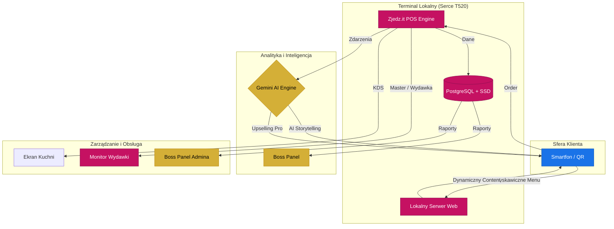

# Oferta Biznesowa: Zjedz.it POS v3.0 (Edge Terminal Edition)

> [!TIP]
> **Zjedz.it POS** to nie tylko oprogramowanie. To Twoja prywatna chmura w lokalu (Edge Computing), działająca z prędkością dysków SSD i mocą Gemini AI.

## 1. Korzyści dla Twojego Biznesu

### ⚡ Edge Terminal: Lenovo T520
Nasz system to nie jest zwykła aplikacja przeglądarkowa. To potężna jednostka obliczeniowa w Twoim lokalu:
*   **Baza PostgreSQL na dysku SSD**: Błyskawiczny dostęp do danych, brak opóźnień przy dużym ruchu.
*   **Architektura Autonomiczna**: Wszystko dzieje się u Ciebie. Brak internetu? System nadal działa, zapisuje zamówienia i synchronizuje je, gdy sieć wróci.
*   **Płynność 60 FPS**: Interfejs menu PWA działa jak natywna aplikacja dzięki zoptymalizowanemu silnikowi na terminalu T520.

### 🤖 Gemini AI - Twój Najlepszy Sprzedawca
*   **AI Storyteller**: Buduje emocjonalną więź z klientem poprzez personalizowane żarty i opowieści o daniach.
*   **Profit Architect**: Analizuje koszyk w czasie rzeczywistym i sugeruje dodatki, które realnie zwiększają marżę.

### 📊 Analityka "Deep Insight"
*   **Zrozum swoich gości**: Codzienna analityka oparta o lokalną bazę PostgreSQL daje Ci wgląd w trendy, o których konkurencja nie ma pojęcia.

---

## 2. Plany Abonamentowe

Wszystko w jednej, przejrzystej opłacie miesięcznej. Bez ukrytych kosztów.

### 🟢 Plan "Standard AI"
*Najlepszy start dla gastronomii.*

*   **Abonament miesięczny: 370 PLN (Netto)**
*   **Wsparcie**: 0.5h profesjonalnego wsparcia technicznego / konsultingu.
*   **Analityka AI**: Cotygodniowe raporty trendów.
*   **Funkcje AI**: Real-time jokes + inteligentny upselling.
*   **Sprzęt**: W cenie zawarta jest rata za terminal Lenovo T520.

---

### 🟡 Plan "Premium AI"
*Dla lokali stawiających na maksymalny zysk i dane.*

*   **Abonament miesięczny: 570 PLN (Netto)**
*   **Wsparcie**: 1h dedykowanego opiekuna technicznego i biznesowego.
*   **Analityka AI**: **Codzienne** raporty, predykcje sprzedaży i optymalizacja zapasów.
*   **Funkcje AI**: Pełny AI Storyteller (wiele osobowości) + Profit Architect Pro.
*   **Sprzęt**: W cenie zawarta jest rata za terminal T520 z dyskiem SSD.

---

## 3. Architektura "Edge Master" (Flow)

Dzięki lokalnemu "sercu" systemu z bazą PostgreSQL, Twój lokal jest niezależny od globalnych awarii chmury.

---

## 4. Hardware - Edge Terminal Kit

W ramach wdrożenia dostarczamy zestaw bazowy, który możesz rozbudować o moduły PRO:

### Zestaw Bazowy (W abonamencie)
1.  **Terminal Lenovo T520** z dyskiem SSD i systemem Linux.
2.  Zestaw personalizowanych kodów QR.
3.  Dostęp do **Master Panelu (Wydawka)** oraz **Boss Panelu (Admin)**.

### Rozszerzenia PRO (Opcjonalnie)
*   **Power Station (UPS)**: Stabilne zasilanie (450 PLN).
*   **5G Industrial Bridge**: Szybki internet z antenami dalekiego zasięgu (600 PLN).
*   **Sunlight Touch (10")**: Ekran czytelny w pełnym słońcu (900 PLN).
*   **Sonic Boom**: Profesjonalne audio do powiadomień (300 PLN).

Dożywotnia gwarancja na ciągłość działania oprogramowania w ramach abonamentu.

---

> [!IMPORTANT]
> **Zjedz.it** to jedyny system, który łączy stabilność lokalnego serwera z potęgą sztucznej inteligencji, pracując na Twój zysk 24/7.
